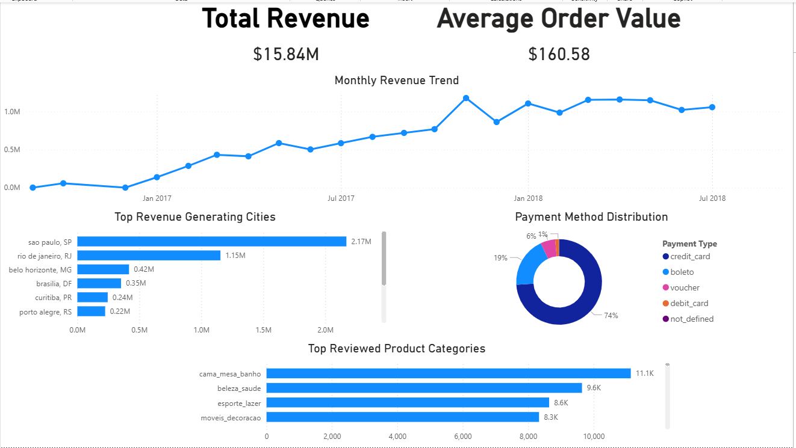

# Brazilian E-Commerce SQL + Power BI Analysis

## Project Overview
This project analyzes the Brazilian E-Commerce Public Dataset from Olist using SQL Server and Power BI.

The goal was to build an end-to-end analytics project for a Data Analyst portfolio by:
- importing raw CSV data into SQL Server
- cleaning and structuring the data using SQL views
- answering key business questions
- building an interactive Power BI dashboard

## Tools Used
- SQL Server
- SQL Server Management Studio (SSMS)
- Power BI Desktop
- GitHub

## Dataset
Brazilian E-Commerce Public Dataset by Olist (Kaggle)

## Business Questions
This project answers the following questions:
1. How has monthly revenue trended over time?
2. Which cities generate the most revenue?
3. What is the average order value?
4. Which payment methods are most common?
5. Which product categories drive the most engagement?

## SQL Work Completed
Created analytical SQL views including:
- `vw_order_revenue`
- `vw_monthly_revenue`
- `vw_city_revenue`
- `vw_average_order_value`
- `vw_payment_method_distribution`
- `vw_highest_rated_products`
- `vw_top_product_categories`

## Dashboard Highlights
The Power BI dashboard includes:
- Total Revenue KPI
- Average Order Value KPI
- Monthly Revenue Trend
- Top Revenue Generating Cities
- Payment Method Distribution
- Most Reviewed Product Categories

## Files in this Repository
- `SQL/create_views.sql` → SQL views used to transform the raw dataset
- `PowerBI/ecommerce_analysis.pbix` → Power BI dashboard file
- `images/dashboard_overview.png` → dashboard screenshot

## Dashboard Preview

## Key Insights
- Revenue increased significantly from 2016 through 2018
- São Paulo and Rio de Janeiro generated the highest revenue
- Credit card was the dominant payment method
- Average order value was approximately $160.58
- Product engagement was strongest in categories such as bed, bath, and beauty products
